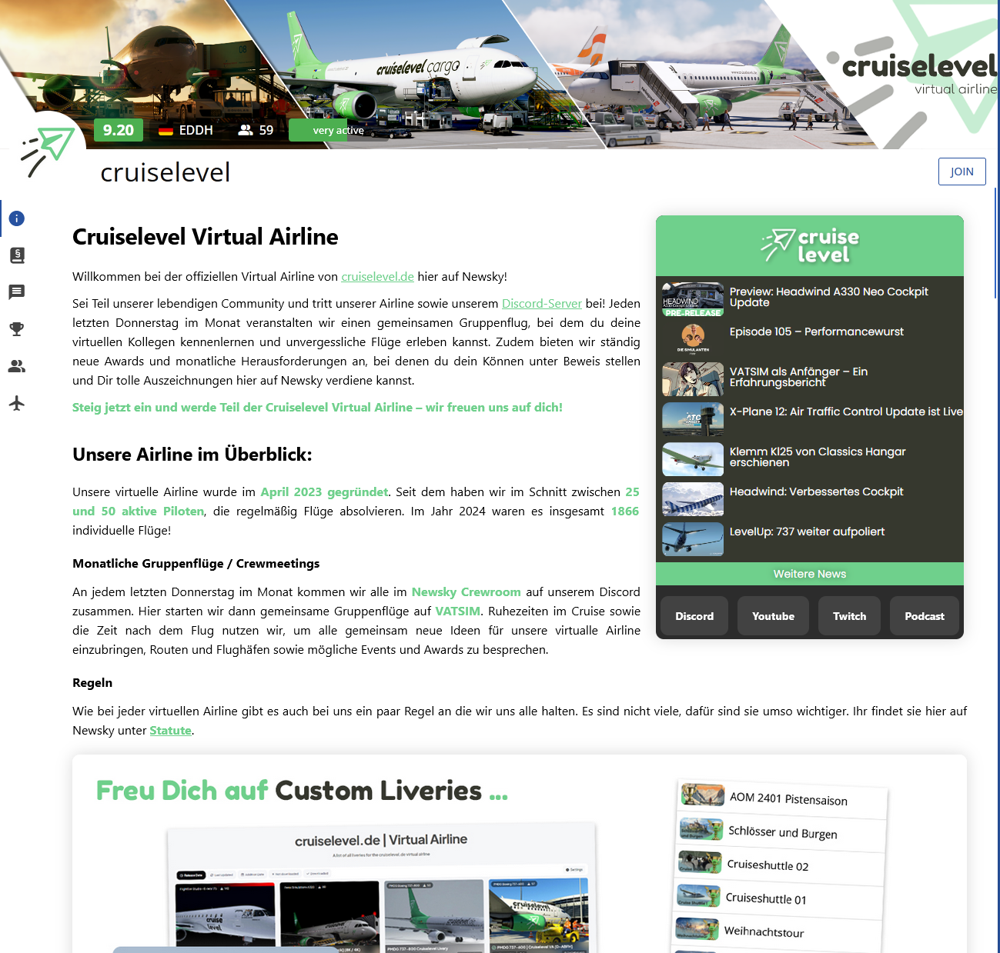

# cruiselevel.de Newsky Virtual Airline Homepage

Welcome to the **cruiselevel Virtual Airline Homepage** repository! 🚀  
This project powers the homepage for the CRZ Virtual Airline on the Newsky platform, offering sim-pilots and enthusiasts a seamless and engaging experience.  

🔗 **Live Website**: [newsky.app/airline/crz/info](https://newsky.app/airline/crz/info)

---

## ✈️ About the Project

The cruiselevel Virtual Airline Homepage is designed to:
- Showcase essential airline information.
- Provide a sleek and user-friendly interface for pilots and visitors.
- Promote the CRZ Virtual Airline's unique culture and operations.

This homepage is tailored for the Newsky ecosystem, ensuring compatibility and responsiveness across devices.

---

## 🎨 Screenshots

  
Example of the homepage interface.

---

## 📄 License

This project is licensed under the [MIT License](./LICENSE).  
Feel free to use and adapt it for your own virtual airline!

---

## 🌟 Acknowledgments

- Special thanks to the [Newsky Platform](https://newsky.app) for their superb platform!.
- Inspired by the passion and creativity of the virtual airline community.

---

For questions or feedback, please reach out via the repository's **Issues** tab or email us at **support@newsky.app**.  

✈️ _Fly high with CRZ Virtual Airline!_
